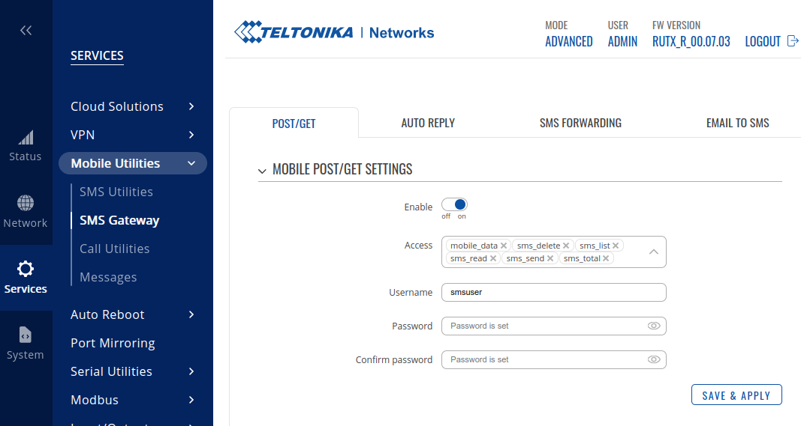

# MIQRO MQTT SMS Service for Teltoniks RUT Devices

MQTT service based on the miqro library.

Tested on a Teltonika RUTX11.

This service uses the Teltonika RUT SMS API to send SMS messages.

## Prerequisites

You need to enable the SMS API on the Teltonika RUT device and configure a username and password, as seen in the following screenshot:

## Installing

To install the software, follow these steps **as root**:

 * If `pip3` is not installed, run `apt install python3-pip` first.
 * Then run `pip3 install miqro_rutos_sms` 
 * Create the configuration file `/etc/miqro.yml`
   * See [examples/miqro.example.yml](examples/miqro.example.yml) for an example
   * See below for a list of configuration options
   * See [the MIQRO documentation](https://github.com/danielfett/miqro#configuration-file) for other options you can use in the configuration file
 * Install the system service: 
   * `miqro_rutos_sms  --install`
   * `systemctl enable miqro_rutos_sms`
   * `systemctl start miqro_rutos_sms`

## Configuration Options

In `/etc/miqro.yml`, you can use these settings to configure the service:

 * `host`: The IP address or host name of the Teltonika RUT device (default `192.168.1.1`).
 * `port`: The port number of the Teltonika RUT device (default `80`).
 * `username`: The username to use for authentication.
 * `password`: The password to use for authentication.
 * `delete_after`: If present, delete message after this time. Time is given like a Python timedelta, e.g., "days: 1" or "seconds: 300". If not present, messages are not deleted.

## MQTT Topics

The service subscribes to the following topics:

 * `service/rutos_sms/send/single/<number>`: Send a single SMS message to the given number. The number must be provided with leading zeros, e.g., `00491700000000`. The message is given as the payload of the MQTT message. The result is published to the topic `service/rutos_sms/sent/single/<number>`.
 * `service/rutos_sms/send/group/<groupname>`: Send a single SMS message to the given group. The message is given as the payload of the MQTT message. The group must be configured in the Teltonika RUT device. The result is published to the topic `service/rutos_sms/sent/group/<groupname>`.
 * `service/rutos_sms/delete`: Delete a single SMS message. The message index is given as the payload of the MQTT message.

The service queries the router every 20 seconds for new messages. The messages are published to the topic `service/rutos_sms/received` in MQTT format like this:

    {"index": "0", "date": "Mon Jan  9 20:01:28 2023", "sender": "+491700000000", "text": "This is an example.", "status": "read"}

Unless the messages are deleted using the `delete_after` configuration, they will be published again on the next restart of the service.
